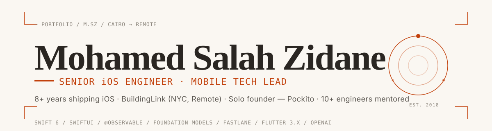

<!--
  Mohamed Salah Zidane — GitHub profile README
  Senior iOS Engineer · Mobile Tech Lead
-->

<a href="https://github.com/mohammed-salah-zidane">
  <picture>
    <source media="(prefers-color-scheme: dark)" srcset="./.github/assets/banner-dark.svg">
    
  </picture>
</a>

<p>
  <a href="https://www.linkedin.com/in/mohamed-salah-zidane/"></a>
  <a href="mailto:mohamed.zidane95@gmail.com"></a>
  <a href="https://apps.apple.com/us/app/pockito-ai-expense-tracker/id6755700782"></a>
  
  
</p>

> **Senior iOS Engineer · Mobile Tech Lead.** Eight years shipping production iOS apps in Swift, SwiftUI, UIKit, and Objective-C — from consumer apps at scale ([TheCryptoApp](https://apps.apple.com/us/app/the-crypto-app-news-alerts/id1339112917), 4M+ downloads) to enterprise fleets ([BuildingLink](https://www.buildinglink.com)'s 80+ white-label iOS flavors automated through Fastlane and the App Store Connect API). Raised App Store ratings from **1.2 → 4.7** and cut startup time by **40%** with Instruments. Solo-founded [**Pockito**](https://apps.apple.com/us/app/pockito-ai-expense-tracker/id6755700782) — an AI-powered iOS expense tracker (4.7★, 22 languages).

---

## Currently

```text
  ▸ Senior iOS Engineer @ BuildingLink   ·  NYC · Remote   ·  Apr 2025 → Present
  ▸ Solo founder & iOS Engineer @ Pockito ·  App Store     ·  Jan 2026 → Present
  ▸ Mentoring 10+ engineers across iOS & Flutter
```

**Day job:** re-architecting the BuildingLink Resident and GEO Staff iOS apps — Objective-C/UIKit → Swift/SwiftUI — and running the CI/CD pipeline that signs, builds, and ships **80+ white-label iOS flavors** in under 24 hours.

**Nights & weekends:** Pockito — designed it, built it, branded it, localized it into 22 languages, and shipped it solo on the App Store.

---

## Featured · Pockito — AI Expense Tracker

<table>
<tr>
<td width="180" valign="top">
  <a href="https://apps.apple.com/us/app/pockito-ai-expense-tracker/id6755700782">
    
  </a>
</td>
<td valign="top">

**The AI expense tracker that *acts* — not just answers.**
Bank-SMS, Apple Pay, voice, receipts, manual, import. Six ways to capture spend, on autopilot. Solo-built from idea to App Store in Swift 6 / SwiftUI.

`Swift 6 strict concurrency` `SwiftUI` `@Observable` `WidgetKit` `App Intents` `Swift Charts` `Core Data` `StoreKit 2` `Vision` `Speech` `CryptoKit` `OpenAI`

[**App Store →**](https://apps.apple.com/us/app/pockito-ai-expense-tracker/id6755700782) · [Source code →](https://github.com/mohammed-salah-zidane/Pockito-iOS)

</td>
</tr>
</table>

<details>
<summary><b>What's inside</b> — click to expand</summary>

- **Architecture.** Swift Package modular architecture — `Domain` · `Data` · `Features` · `Design System`. MVVM with SwiftUI and the Observation framework, NavigationStack-based routing, repository pattern, dependency injection, async/await throughout.
- **AI chatbot.** Natural-language interface on the OpenAI API with function calling and structured outputs — creates budgets, logs bills, runs spending queries. Full **Egyptian Arabic dialect** support.
- **Capture surfaces.** On-device receipt OCR (Vision), voice tracking (Speech), bank-SMS parser covering **50+ banks**, Apple Pay capture via Shortcuts and App Intents.
- **System integrations.** **18 widgets** across Home Screen, Lock Screen, and Control Center with interactive controls and *"Hey Siri, log expense"* support. Spending visualizations built with Swift Charts.
- **Privacy-first.** Account Mode for iCloud sync; Privacy Mode for fully on-device storage with CryptoKit encryption + biometric authentication. No bank login. No data sharing.
- **Localization.** String Catalogs (`.xcstrings`) deployed across 22 languages with RTL support.
- **CI/CD.** Fastlane + GitHub Actions; metadata and screenshots automated via App Store Connect API.

</details>

---

## Impact at scale

<table>
<tr align="center">
<td width="20%"><h3>4M+</h3><sub>TheCryptoApp downloads</sub></td>
<td width="20%"><h3>1.2 → 4.7</h3><sub>App Store rating lift</sub></td>
<td width="20%"><h3>80+</h3><sub>iOS flavors automated</sub></td>
<td width="20%"><h3>22</h3><sub>languages shipped</sub></td>
<td width="20%"><h3>40%</h3><sub>faster startup time</sub></td>
</tr>
<tr align="center">
<td><sub>TrustSwap · iOS Tech Lead</sub></td>
<td><sub>BuildingLink Resident + GEO</sub></td>
<td><sub>BuildingLink · Fastlane + ASC API</sub></td>
<td><sub>Pockito · String Catalogs</sub></td>
<td><sub>Instruments-driven</sub></td>
</tr>
</table>

---

## Career

<table>
<tr><td width="160" valign="top"><sub><b>Apr 2025 → Now</b></sub></td><td valign="top"><a href="https://www.buildinglink.com"><b>BuildingLink</b></a> · Senior iOS Engineer · NYC, Remote<br><sub>Resident + GEO Staff iOS · 80+ white-label flavors · 6,500+ buildings</sub></td></tr>
<tr><td valign="top"><sub><b>Apr 2023 → Apr 2025</b></sub></td><td valign="top"><b>Square1</b> · Staff Mobile Software Engineer · Dublin, Remote<br><sub>TheBusinessPost · Riide (40+ flavors) · MyHome.ie · Coosto · SayTV Chat SDK</sub></td></tr>
<tr><td valign="top"><sub><b>Apr 2022 → Apr 2023</b></sub></td><td valign="top"><b>Quiet</b> · Senior Mobile Software Engineer · Paris, Remote<br><sub>Clean Manager · TikDown · Habits with Henry · PuffCount · Mentor AI · QuietOpsToolkit</sub></td></tr>
<tr><td valign="top"><sub><b>Apr 2020 → Apr 2022</b></sub></td><td valign="top"><b>TrustSwap</b> · iOS Tech Lead · Canada, Remote<br><sub><a href="https://apps.apple.com/us/app/the-crypto-app-news-alerts/id1339112917">TheCryptoApp</a> — 4M+ downloads · built the iOS team from scratch · Clean Architecture migration</sub></td></tr>
<tr><td valign="top"><sub><b>Oct 2019 → Apr 2020</b></sub></td><td valign="top"><b>PayTabs</b> · Senior iOS SDK Engineer · Cairo, Remote<br><sub>iOS SDK + cross-platform wrappers (Flutter, React Native, Cordova, Ionic)</sub></td></tr>
<tr><td valign="top"><sub><b>Oct 2018 → Oct 2019</b></sub></td><td valign="top"><b>Roaa Technology</b> · Mobile Engineer · Dubai, Remote<br><sub>Freejna — 500K users · crash-rate stabilization + perf refactor</sub></td></tr>
<tr><td valign="top"><sub><b>Jan 2018 → Oct 2018</b></sub></td><td valign="top"><b>Alamat Tech</b> · iOS Engineer · Cairo<br><sub>Aladarby (User + Captain) · Rakeb · Rakeb Captain — ride-hailing</sub></td></tr>
</table>

---

## Toolbox

#### Core iOS

<p>
  
  
  
  
  
</p>

```
Languages         Swift 6 · Objective-C · C/C++
UI frameworks     SwiftUI · UIKit · WidgetKit · App Intents · App Shortcuts
                  Live Activities (ActivityKit) · Swift Charts · Swift Macros
                  Observation (@Observable) · NavigationStack · Combine
Apple frameworks  HealthKit · Core ML · Vision · Speech · Foundation Models
                  StoreKit 2 · CryptoKit · LocalAuthentication · CloudKit · Core Bluetooth
Concurrency       Swift 6 strict · async/await · Actors · MainActor · GlobalActor
                  Structured Concurrency · Sendable · Task Groups · AsyncSequence · GCD
Architecture      Clean Modular · MVVM · MV (SwiftUI) · TCA · VIPER · Coordinator
                  Repository · SOLID · Protocol-Oriented · Dependency Injection
Data & storage    Core Data · SwiftData · Realm · Keychain · iCloud Drive
Testing           Swift Testing (Xcode 16) · XCTest · XCUITest · TDD · Mocking
```

#### Cross-platform (Flutter)

<p>
  
  
  
  
</p>

```
Language          Dart 3 (sound null safety)
Framework         Flutter 3.x · Material 3 · Cupertino · custom widgets & theming
State             Bloc · Cubit · Riverpod · Provider · GetX
Architecture      Clean · MVVM · feature-first modules · get_it · injectable
Networking        Dio · Retrofit · freezed · json_serializable · build_runner
Storage           Hive · Isar · sqflite · secure_storage
Routing & test    GoRouter · AutoRoute · Navigator 2.0 · flutter_test · mocktail · golden
Native bridge     Platform Channels · Method Channels · Pigeon · FFI · Swift/Kotlin plugins
```

#### Delivery & practice

<p>
  
  
  
  
  
  
</p>

```
CI/CD             Fastlane · fastlane match · Xcode Cloud · GitHub Actions
                  GitLab CI/CD · Bitrise · Codemagic · App Store Connect API · TestFlight
Profiling         Instruments (Time Profiler · Allocations · Leaks) · LLDB
Networking        REST · GraphQL · WebSocket · Socket.IO · OAuth 2.0 · RSA · Biometric
AI / ML on device Foundation Models · Apple Intelligence · Core ML · Vision · Speech
                  OpenAI API (function calling + structured outputs) · Claude API
Payments          StoreKit 2 · IAP (RevenueCat · Adapty · Apphud)
                  Apple Pay · Google Pay · Stripe · Adyen · PayTabs · Paymob
IoT & access      Brivo · Salto · ButterflyMX · Latch · CoreBluetooth (BLE)
Localization      String Catalogs (.xcstrings) · NSLocalizedString · easy_localization
                  22-language deployment · RTL/LTR
Observability     Firebase Analytics · Crashlytics · Amplitude · Mixpanel · New Relic
AI dev tooling    Claude Code · Cursor · GitHub Copilot · Codex (spec-driven agentic flows)
```

---

## Selected work

<table>
  <tr>
    <td width="50%" valign="top">
      <h3><a href="https://github.com/mohammed-salah-zidane/Pockito-iOS">Pockito</a></h3>
      <p><sub>iOS · Swift 6 · SwiftUI · Modular SPM · OpenAI · StoreKit 2 · 22 languages</sub></p>
      <p>The AI expense tracker on the App Store. Solo-built end-to-end: architecture, design system, brand, ASO, infra.</p>
      <p><a href="https://apps.apple.com/us/app/pockito-ai-expense-tracker/id6755700782">App Store ↗</a></p>
    </td>
    <td width="50%" valign="top">
      <h3><a href="https://github.com/mohammed-salah-zidane/Frame">Frame</a></h3>
      <p><sub>iOS 17+ · Swift 6 strict · SwiftUI · Clean Architecture · MVVM + Coordinator</sub></p>
      <p>Offline-first Unsplash-style photography app with a full monetization funnel — paywall, win-back, restore, sponsored insertion. <b>363 tests across three tiers.</b></p>
    </td>
  </tr>
  <tr>
    <td width="50%" valign="top">
      <h3><a href="https://github.com/mohammed-salah-zidane/SwiftyNet">SwiftyNet</a> <sub>· ★ 18</sub></h3>
      <p><sub>Swift · networking library · open source</sub></p>
      <p>A generic, lightweight Swift network layer with simplified HTTP request handling and response management.</p>
    </td>
    <td width="50%" valign="top">
      <h3><a href="https://github.com/mohammed-salah-zidane/TwitterClone">TwitterClone</a> <sub>· ★ 28</sub></h3>
      <p><sub>Swift · MVVM · RxSwift · SOLID</sub></p>
      <p>Reference modular iOS app demonstrating architecture components for scale, testability, and maintainability.</p>
    </td>
  </tr>
  <tr>
    <td width="50%" valign="top">
      <h3><a href="https://github.com/mohammed-salah-zidane/SwiftHeadFirstDesignPatterns">SwiftHeadFirstDesignPatterns</a> <sub>· ★ 4</sub></h3>
      <p><sub>Swift · educational · design patterns</sub></p>
      <p>The classic <em>Head First Design Patterns</em> examples re-implemented in idiomatic Swift.</p>
    </td>
    <td width="50%" valign="top">
      <h3><a href="https://github.com/mohammed-salah-zidane/network-framework-with-requests-recording">Network Recording Framework</a> <sub>· ★ 2</sub></h3>
      <p><sub>Swift · developer tool</sub></p>
      <p>A Swift networking framework that records every request — a debugging aid for tracing API behavior in flight.</p>
    </td>
  </tr>
  <tr>
    <td width="50%" valign="top">
      <h3><a href="https://github.com/mohammed-salah-zidane/iOSCareerPath">iOSCareerPath</a> <sub>· ★ 1</sub></h3>
      <p><sub>career guide · leadership</sub></p>
      <p>A practitioner's map of the iOS engineer career path — what to learn, in what order, at each level.</p>
    </td>
    <td width="50%" valign="top">
      <h3><a href="https://github.com/mohammed-salah-zidane/GithubClient">GithubClient</a> <sub>· ★ 3</sub></h3>
      <p><sub>Swift · modular MVVM · RxSwift · SwiftyNet</sub></p>
      <p>A GitHub client iOS app built on the same modular architecture used in production work — and on top of SwiftyNet.</p>
    </td>
  </tr>
</table>

<p><sub>↗ More on <a href="https://github.com/mohammed-salah-zidane?tab=repositories">my repositories page</a> — 57 public repos and counting.</sub></p>

---

## Open-source & SDKs

- 📦 [**SwiftyNet**](https://github.com/mohammed-salah-zidane/SwiftyNet) — Swift networking library. 18★, used across personal and educational projects.
- 📦 [**PayTabs Ionic Native Plugin**](https://www.npmjs.com/package/@paytabs/ionic-native) — authored cross-platform Ionic wrapper around the native PayTabs iOS/Android SDKs. Published to npm.
- 📦 [**Network-Framework-With-Requests-Recording**](https://github.com/mohammed-salah-zidane/network-framework-with-requests-recording) — request-capture and replay tool for debugging mobile API traffic.

---

## Production apps — 25+ shipped across 9 years

A chronological tour of every iOS app I've put my name on. Live App Store links where the app is still available.

<table>
  <tr>
    <td valign="top" width="40%"><sub><b>SOLO PRODUCT · 2026 →</b></sub></td>
    <td valign="top">
      🟣 <a href="https://apps.apple.com/us/app/pockito-ai-expense-tracker/id6755700782"><b>Pockito · AI Expense Tracker</b></a> — built end-to-end, solo. Swift 6 / SwiftUI / @Observable. 22 languages. 4.7★.
    </td>
  </tr>
  <tr>
    <td valign="top"><sub><b>BUILDINGLINK · 2025 →</b><br>Senior iOS Engineer<br>NYC, Remote</sub></td>
    <td valign="top">
      🏢 <a href="https://apps.apple.com/us/app/buildinglink-resident-app/id355921355"><b>BuildingLink Resident</b></a> — property comms, package alerts, work orders, visitor entry. 6,500+ buildings.<br>
      🛠️ <a href="https://apps.apple.com/us/app/geo-staff-app-by-buildinglink/id465966658"><b>GEO Staff</b></a> — front-desk and engineering workflow for property staff.<br>
      🎨 <b>80+ white-label flavors</b> of Resident — fully automated signing + branding + ASC delivery in &lt;24h.
    </td>
  </tr>
  <tr>
    <td valign="top"><sub><b>SQUARE1 · 2023–2025</b><br>Staff Mobile Engineer<br>Dublin, Remote</sub></td>
    <td valign="top">
      📰 <a href="https://apps.apple.com/us/app/the-business-post/id467117236"><b>The Business Post</b></a> — Ireland's business daily, iOS.<br>
      🏠 <a href="https://apps.apple.com/us/app/myhome-ie/id368923847"><b>MyHome.ie</b></a> — Ireland's largest property portal — perf-tuned via Instruments.<br>
      📊 <a href="https://apps.apple.com/us/app/coosto/id778600146"><b>Coosto</b></a> — social-media management platform.<br>
      🚗 <a href="https://apps.apple.com/us/app/riide/id1131008247"><b>Riide</b></a> — private-hire fleet · <b>40+ white-label flavors</b>.<br>
      💬 <b>SayTV Chat SDK</b> — embedded chat for partner streaming apps.
    </td>
  </tr>
  <tr>
    <td valign="top"><sub><b>QUIET · 2022–2023</b><br>Senior Mobile Engineer<br>Paris, Remote</sub></td>
    <td valign="top">
      🧹 <a href="https://apps.apple.com/us/app/clean-manager-storage-cleaner/id1579881271"><b>Clean Manager</b></a> — storage cleanup, duplicate photo detection.<br>
      🤖 <a href="https://apps.apple.com/us/app/mentor-ai-your-daily-guide/id6474674189"><b>Mentor AI</b></a> — OpenAI-powered daily coach.<br>
      🧠 <a href="https://apps.apple.com/us/app/habits-with-henry/id1530541067"><b>Habits with Henry</b></a> — habit tracker for adults with ADHD.<br>
      🚭 <a href="https://apps.apple.com/us/app/puff-count-quit-vaping-now/id1488580640"><b>Puff Count</b></a> — quit-vaping companion.<br>
      🎬 <b>TikDown</b> — TikTok video saver (sunset).<br>
      🧰 <b>QuietOpsToolkit</b> — internal SDK for subs, analytics, push, flags across the Quiet portfolio.
    </td>
  </tr>
  <tr>
    <td valign="top"><sub><b>TRUSTSWAP · 2020–2022</b><br>iOS Tech Lead<br>Canada, Remote</sub></td>
    <td valign="top">
      🪙 <a href="https://apps.apple.com/us/app/the-crypto-app-news-alerts/id1339112917"><b>TheCryptoApp</b></a> — crypto portfolio + real-time alerts. <b>4M+ downloads.</b> Built the iOS team from scratch · led Clean Architecture migration · added Pro subscriptions, OAuth 2.0, RSA encryption.
    </td>
  </tr>
  <tr>
    <td valign="top"><sub><b>PAYTABS · 2019–2020</b><br>Senior SDK Engineer<br>Cairo, Remote</sub></td>
    <td valign="top">
      💳 <b>PayTabs iOS SDK</b> — production payments SDK shipped to integration partners.<br>
      🔌 <a href="https://www.npmjs.com/package/com.paytabs.ionic.native"><b>PayTabs Ionic Native Plugin</b></a> — authored from scratch and published to npm.<br>
      🌉 Cross-platform wrappers — Flutter, React Native, Cordova — all on top of the native iOS/Android SDKs.
    </td>
  </tr>
  <tr>
    <td valign="top"><sub><b>ROAA TECH · 2018–2019</b><br>Mobile Engineer<br>Dubai, Remote</sub></td>
    <td valign="top">
      🛒 <a href="https://apps.apple.com/us/app/freejna/id1493282650"><b>Freejna</b></a> — UAE classifieds / marketplace. <b>500K users.</b> Stabilization + perf refactor + Android parity.
    </td>
  </tr>
  <tr>
    <td valign="top"><sub><b>ALAMAT TECH · 2018</b><br>iOS Engineer<br>Cairo</sub></td>
    <td valign="top">
      🚖 <a href="https://apps.apple.com/us/app/%D8%B9%D9%84%D9%89-%D8%AF%D8%B1%D8%A8%D9%8A/id1509395264"><b>Aladarby — Rider</b></a> · <a href="https://apps.apple.com/us/app/%D8%B9%D9%84%D9%89-%D8%AF%D8%B1%D8%A8%D9%8A-%D9%83%D8%A7%D8%A8%D8%AA%D9%86/id1509095481"><b>Aladarby — Captain</b></a> — ride-hailing, two-app suite.<br>
      🚕 <a href="https://apps.apple.com/us/app/rakeb-captain/id1541858039"><b>Rakeb Captain</b></a> — driver companion to the Rakeb passenger app.
    </td>
  </tr>
  <tr>
    <td valign="top"><sub><b>SIDE PROJECTS</b><br>Cairo / Florida / Riyadh</sub></td>
    <td valign="top">
      🥗 <a href="https://apps.apple.com/us/app/nutrisha/id1629848188"><b>Nutrisha</b></a> (Cairo) — nutrition & meal planning, iOS.<br>
      👥 <b>Friends</b> (Florida) — social-connection iOS app.<br>
      📍 <b>Masalekh Riyadh</b> (Riyadh) — local-services platform.<br>
      📚 <b>Read On Community</b> (Cairo) — readers' community iOS app.<br>
      🏥 <b>IMC Apps</b> — internal-process apps for International Medical Center, iOS + Android.
    </td>
  </tr>
</table>

<p align="center">
  <sub>
    <b>4M+</b> downloads at peak (TheCryptoApp) ·
    <b>500K+</b> users (Freejna) ·
    <b>6,500+</b> buildings (BuildingLink) ·
    <b>80+</b> automated flavors ·
    <b>22</b> languages (Pockito) ·
    <b>9</b> countries shipped from
  </sub>
</p>

---

## GitHub

<p>
  <a href="https://github.com/mohammed-salah-zidane">
    
  </a>
  <a href="https://github.com/mohammed-salah-zidane">
    
  </a>
</p>

<p>
  
</p>

---

## Get in touch

If you're hiring an iOS lead, want to collaborate on a Swift open-source project, or just want to talk shop about Swift 6 concurrency, Foundation Models, or modular SPM architecture — my inbox is open.

- 📧 **Email** — [mohamed.zidane95@gmail.com](mailto:mohamed.zidane95@gmail.com)
- 💼 **LinkedIn** — [mohamed-salah-zidane](https://www.linkedin.com/in/mohamed-salah-zidane/)
- 🍎 **App Store** — [Pockito · AI Expense Tracker](https://apps.apple.com/us/app/pockito-ai-expense-tracker/id6755700782)
- 📍 **Location** — Cairo, Egypt — open to remote roles worldwide

<sub><i>BSc Computer Science, Assiut University (2014–2018) · Arabic (native) · English (fluent)</i></sub>

